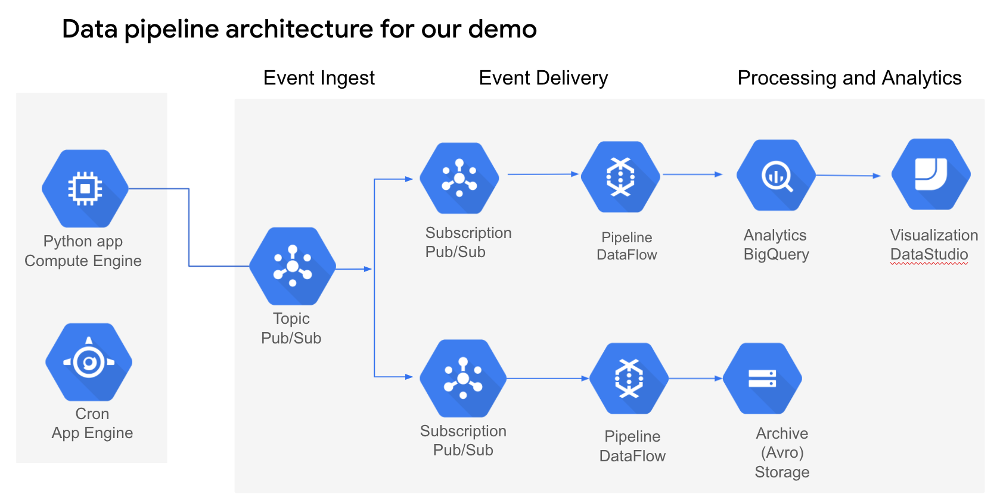
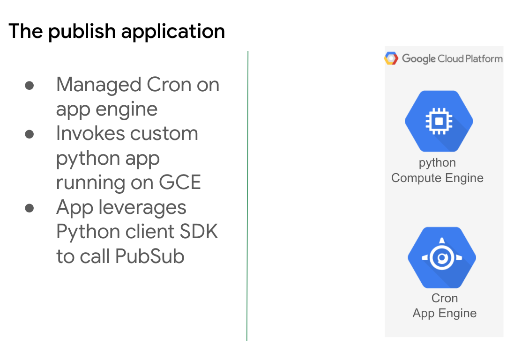
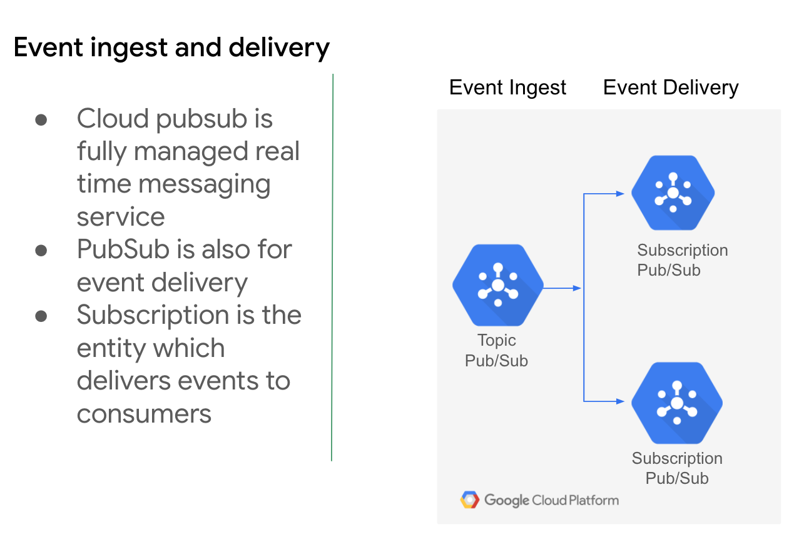
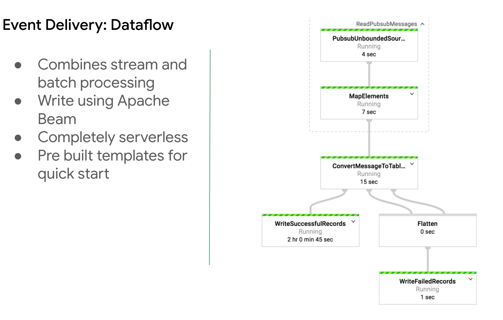
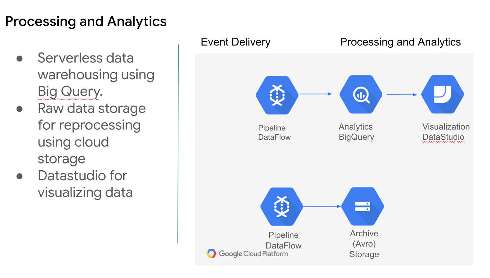
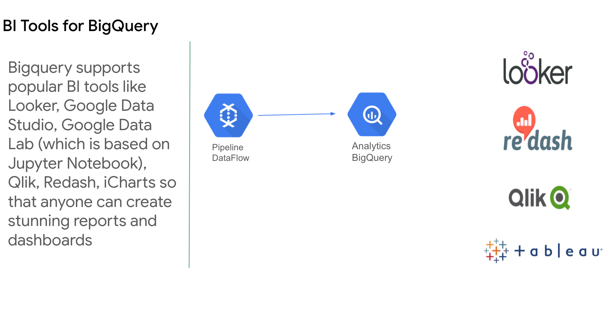
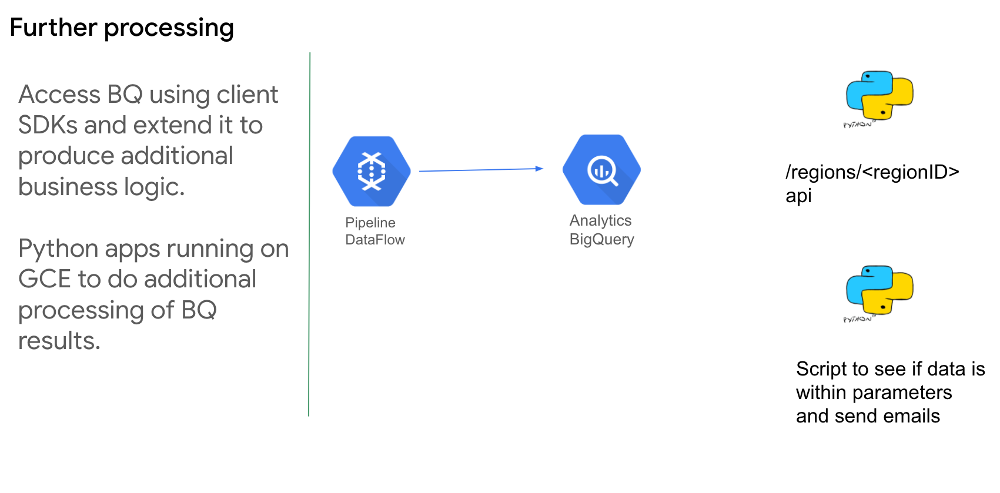

We want to use the data published by city of Chicago to create a realtime data pipeline which will show the traffic condition 
by each road in near real time.
There must be some dashboards to view the data as well as notifications must be triggered when certain thresholds are met.

**Source of data**: https://data.cityofchicago.org/

Overall data pipleine designed and built here:

The applications which are consuiming the data from the chicago webservice and then pushing it to the data pipeline

Pushing the data to a pub sub and from there pushing it for further processing

We used Dataflow templates to push the data to BQ

We used Datastudio for visualization.
We also stored a copy of the data inGCS buckets in Avro format for future processing.

Look at some of the BI tools available for BQ

We also needed to further process the data to trigger events in case some thresholds are met

**Features not quite implemented**

Data reprocessing. This is a secondary processing of the raw data to ensure original calculations were correct. This can be done on a weekly or monthly basis

In real life there will be multiple feeds of data which needs to trigger various kinds of downstream system
This can be done using Cloud composer aka Apache Airflow.

